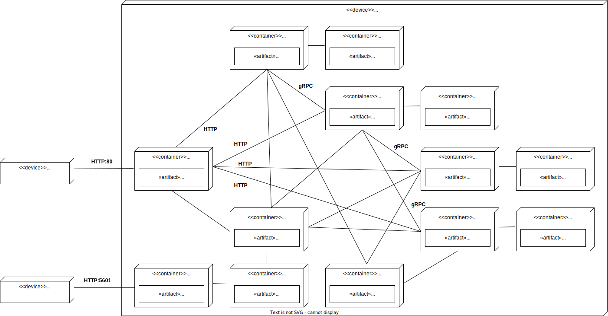

# :speech_balloon: Messenger

This is messenger back end pet-project made for personal educational purposes.<br>
If you are looking for an open-source REST API for your own front end/mobile app pet-project or something else, feel free to use it. 

## Features

- User registration, basic profile editing, user deletion.
- User session management and info (time started, last activity, IP, client).
- Messaging with text and any files.
- Editable and deletable messages.
- Message syncing between multiple clients.
- Own file storage with file-level access and garbage collector.

## REST API specification

Fully functional client published in Swagger UI on [GitHub Pages](https://barpav.github.io/msg-api-spec) (OpenAPI 3.0 YAML source can be found [here](https://github.com/barpav/msg-api-spec/blob/main/messenger-api.yaml)).<br>
Application supports [CORS](https://en.wikipedia.org/wiki/Cross-origin_resource_sharing), so requests can be made directly from GitHub Pages.

## How to launch it

All components are Docker images, so it's required to have Docker (Docker Engine or Docker Desktop) installed, as well as Docker Compose.<br>

Download or clone this repo and run:
```sh
make up
```

To stop the application run:
```sh
make down
```

<details>
    <summary>Why I use "sudo docker" instead of just "docker" in the Makefile</summary>

<br>

I use Docker Engine instead of Docker Desktop and according to the [Docker official documentation](https://docs.docker.com/engine/install/linux-postinstall/#manage-docker-as-a-non-root-user): <br>

> The Docker daemon binds to a Unix socket, not a TCP port. By default it's the root user that owns the Unix socket, and other users can only access it using sudo. The Docker daemon always runs as the root user.<br>
> <br>
> If you don't want to preface the docker command with sudo, create a Unix group called docker and add users to it

And: <br>

> The docker group grants root-level privileges to the user. For details on how this impacts security in your system, see [Docker Daemon Attack Surface](https://docs.docker.com/engine/security/#docker-daemon-attack-surface). <br>

But if you are uncomfortable with `sudo` for some reason and it's unnecessary for your system, instead of `make up` you may run:
```sh
docker-compose up -d --wait
```

And instead of `make down`:
```sh
docker-compose down
```

</details>

## Logs

Logs from all major components are available in Kibana at http://localhost:5601.

<details>
    <summary>What it looks like</summary>


</details>

## Architecture overview
### Components and tech stack

| Component | Function | Stack |
| --------- | ----------- | ----------- |
| [API gateway](https://github.com/barpav/msg-api-gateway) | Front end web server and reverse proxy | Nginx |
| [Users](https://github.com/barpav/msg-users) | User management microservice | Go, PostgreSQL, RabbitMQ |
| [Sessions](https://github.com/barpav/msg-sessions) | User authentication and session management microservice | Go, Redis |
| [Messages](https://github.com/barpav/msg-messages) | Messaging microservice | Go, PostgreSQL, RabbitMQ |
| [Files](https://github.com/barpav/msg-files) | File sharing microservice | Go, MongoDB, RabbitMQ |
| [Logs](https://github.com/barpav/msg-logs) | Logs collection, storage and visualization | Filebeat, Elasticsearch, Kibana |

### Deployment diagram

[](https://raw.githubusercontent.com/barpav/messenger/main/docs/deployment_diagram.svg)

<p align=center> (click to open on full screen) </p>
